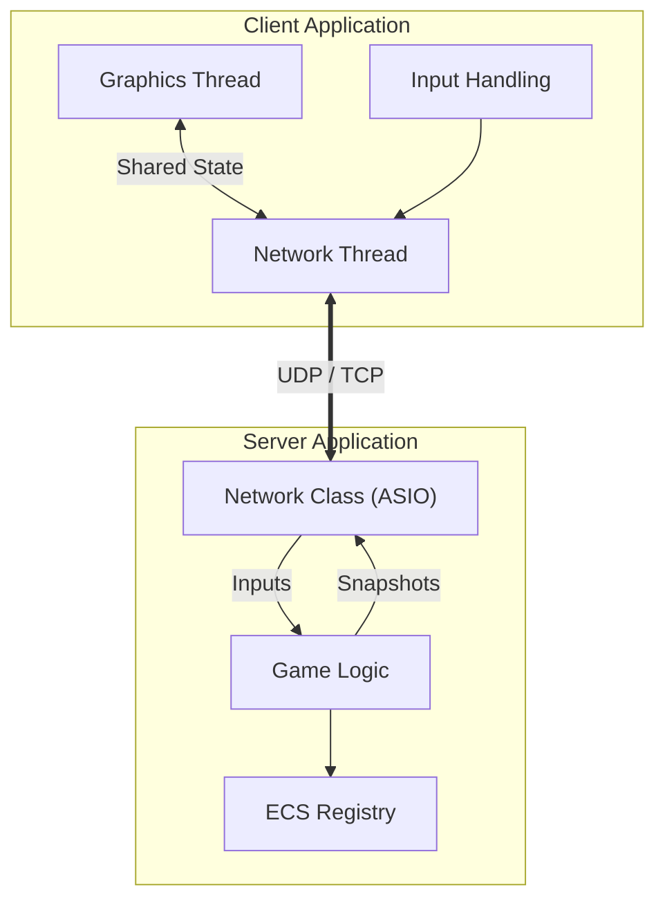
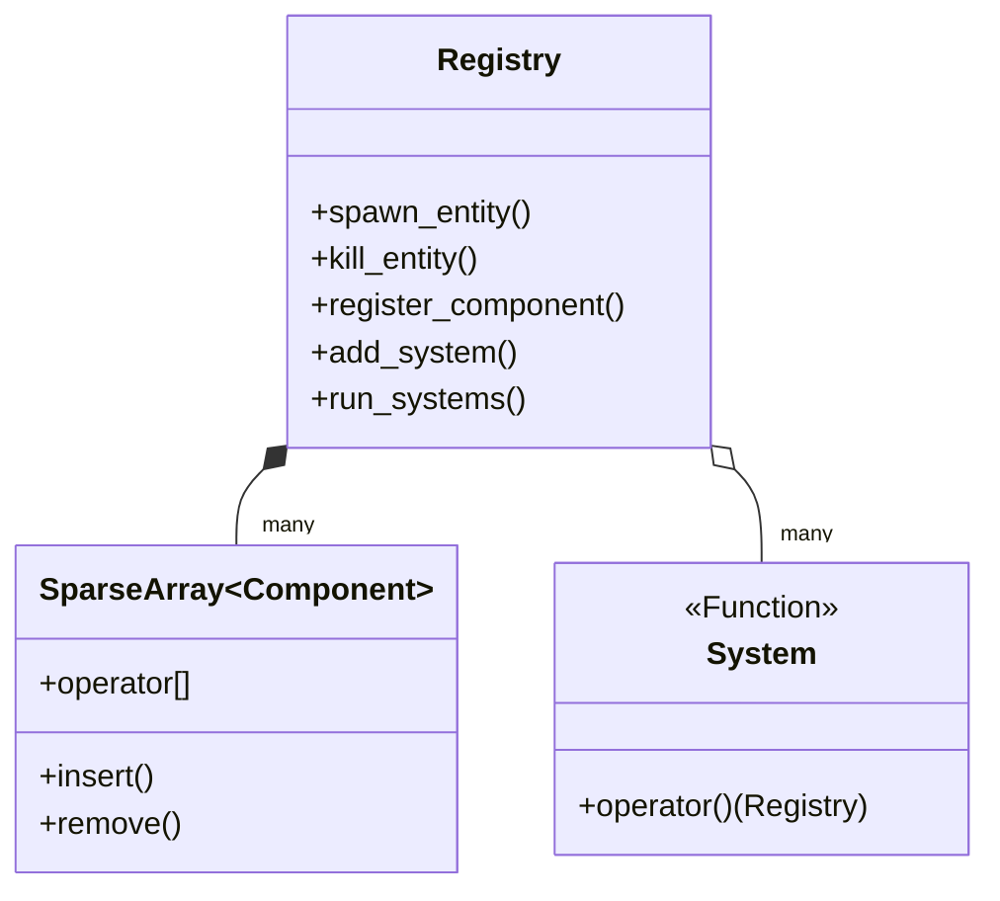
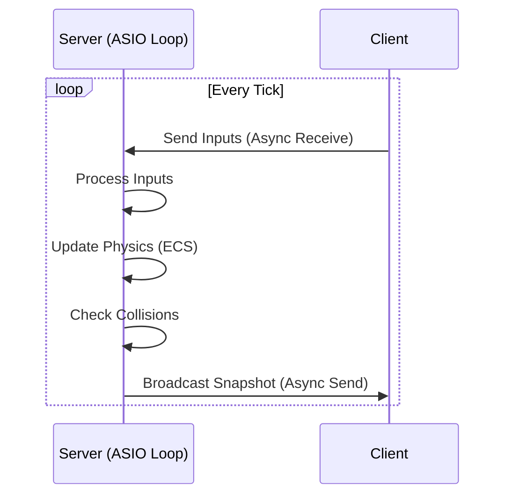
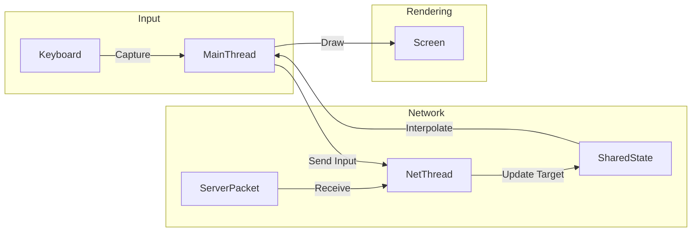

# Architecture

## Table of Contents

- [1. Overview](#1-overview)
- [2. Engine Architecture (ECS)](#2-engine-architecture-ecs)
- [3. Server Architecture](#3-server-architecture)
- [4. Client Architecture](#4-client-architecture)
- [5. Network Protocol Integration](#5-network-protocol-integration)

## 1. Overview

R-TYPE J.A.M.E.S. is built upon a **Client-Server** architecture using a custom **Entity Component System (ECS)** engine. The system is designed to be modular, performant, and network-efficient, adhering to the **Authoritative Server** model.

### High-Level Architecture

---

## 2. Engine Architecture (ECS)

The core of the game logic is driven by a custom ECS library located in the `engine/` directory. This library is header-only (mostly) and provides the foundation for both the Client and Server.

### Core Concepts

- **Registry (`registry`)**: The central manager that handles entities, components, and systems. It maps `Entity` IDs to their component data.
- **Entity**: A simple unique identifier (`size_t`). It has no data itself but serves as a key to retrieve components.
- **Component**: Plain Old Data (POD) structs (e.g., `Position`, `Velocity`, `Health`). Stored in contiguous memory using `SparseArray`.
- **System**: Logic functions that iterate over specific combinations of components to update the game state (e.g., `MovementSystem`, `CollisionSystem`).
- **Sparse Array**: A memory-efficient container that stores components packed tightly, allowing for cache-friendly iteration.

### ECS Data Flow

---

## 3. Server Architecture

The server is the **Authority**. It maintains the "true" state of the game and broadcasts it to clients. It is designed to be robust and efficient.

### Threading Model

The server operates on a **single thread** and uses **ASIO async functions** for asynchronous capabilities. ASIO handles the threading part internally, allowing the server to handle network operations and game logic concurrently without manual thread management.

- **Network Operations**:
  - Handles all incoming UDP/TCP traffic using `Asio` async callbacks.
  - Deserializes packets directly upon receipt.
  - Sends outgoing packets (Snapshots) asynchronously.

- **Game Logic**:
  - Runs the main Game Loop.
  - Processes inputs received via network callbacks.
  - Runs ECS Systems (Physics, Collision, AI).
  - Generates World Snapshots and schedules them for sending.

### Server Loop

---

## 4. Client Architecture

The client is responsible for rendering the game state and capturing user input. It uses **SFML** for graphics and audio.

### Threading Model

The client also operates on **2 dedicated threads**:

1. **Network Thread**:
    - Listens for Server Snapshots (UDP) and Events (TCP).
    - Updates the local "Network State" (the target state to interpolate towards).
    - Sends Player Inputs to the server.

2. **Graphics Thread (Main Thread)**:
    - Handles the Window and Event Polling (SFML requirement).
    - Interpolates entities between the last known state and the current Network State.
    - Renders the scene.
    - Captures Input and pushes it to the Network Thread.

### Rendering & Interpolation

To ensure smooth gameplay despite network latency, the client does not just "teleport" entities to the server's position. Instead, it uses **Snapshot Interpolation**:

- **Visual State**: The position currently drawn on screen.
- **Target State**: The latest position received from the server.
- **Logic**: `VisualPos = Lerp(CurrentPos, TargetPos, DeltaTime * SmoothingFactor)`

### Client Loop

---

## 5. Network Protocol Integration

The architecture strictly follows the binary protocol defined in `protocol.md`.

- **TCP**: Used for reliable session events (Connect, Disconnect, Game Start).
- **UDP**: Used for high-frequency gameplay data (Inputs, Snapshots).
- **Packet Handling**:
  - **TickId**: Used to order UDP packets and discard old data.
  - **Serialization**: Custom binary serializer ensures strict byte alignment (Little Endian).

### Data Synchronization Strategy

1. **Client Input**: Sent as a bitmask (Held Keys) every tick.
2. **Server Validation**: Server applies input to the entity's velocity/state.
3. **Server Snapshot**: Server sends the full list of visible entities (ID, Type, Position, Angle).
4. **Client Correction**: Client updates its local entities to match the server's snapshot, spawning or destroying entities as needed.
