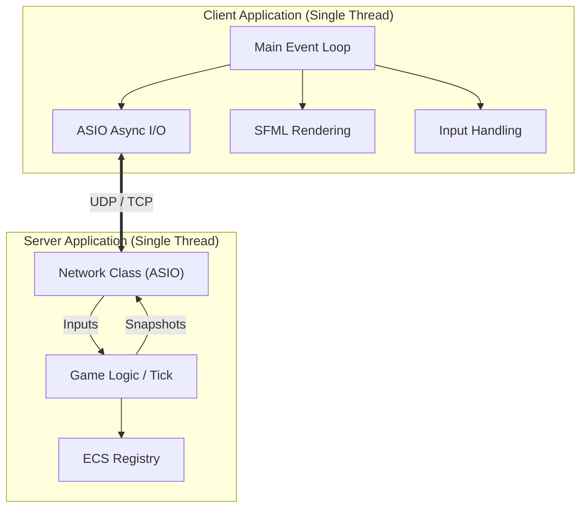
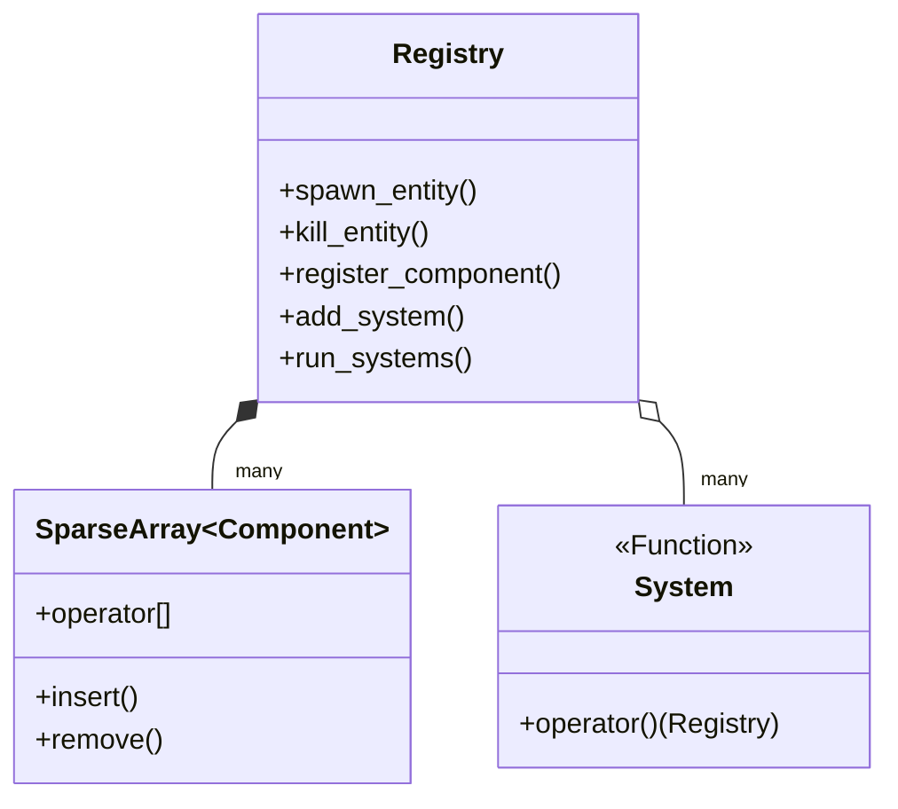
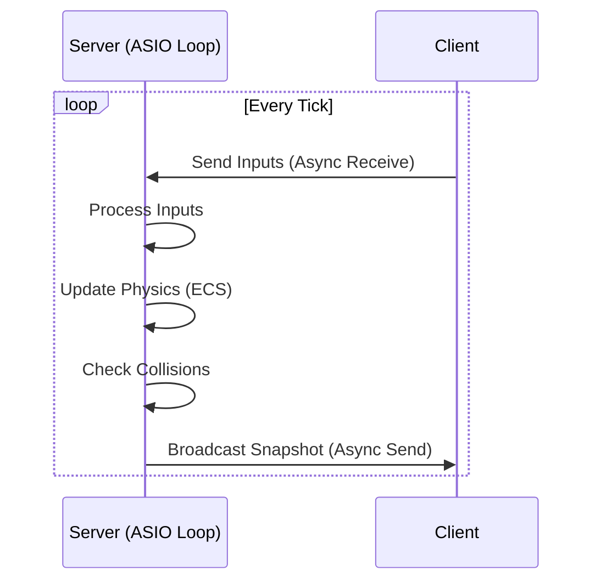
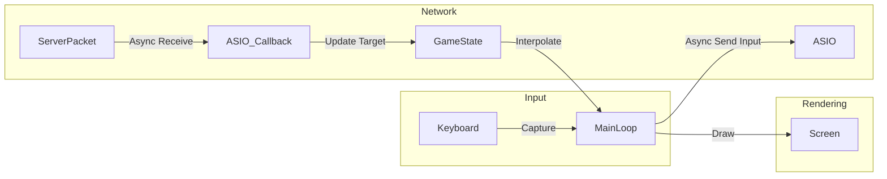

# Architecture

## Table of Contents

- [1. Overview](#1-overview)
- [2. Engine Architecture (ECS)](#2-engine-architecture-ecs)
- [3. Server Architecture](#3-server-architecture)
- [4. Client Architecture](#4-client-architecture)
- [5. Network Protocol Integration](#5-network-protocol-integration)
- [6. Client Components](#6-client-components)
- [7. Client Systems](#7-client-systems)

## 1. Overview

R-TYPE J.A.M.E.S. is built upon a **Client-Server** architecture using a custom **Entity Component System (ECS)** engine. The system is designed to be modular, performant, and network-efficient, adhering to the **Authoritative Server** model.

### High-Level Architecture



---

## 2. Engine Architecture (ECS)

The core of the game logic is driven by a custom ECS library located in the `engine/` directory. This library is header-only (mostly) and provides the foundation for both the Client and Server.

### Core Concepts

- **Registry (`registry`)**: The central manager that handles entities, components, and systems. It maps `Entity` IDs to their component data.
- **Entity**: A simple unique identifier (`size_t`). It has no data itself but serves as a key to retrieve components.
- **Component**: Plain Old Data (POD) structs (e.g., `Position`, `Velocity`, `Health`). Stored in contiguous memory using `SparseArray`.
- **System**: Logic functions that iterate over specific combinations of components to update the game state (e.g., `MovementSystem`, `CollisionSystem`).
- **Sparse Array**: A memory-efficient container that stores components packed tightly, allowing for cache-friendly iteration.

### ECS Data Flow



---

## 3. Server Architecture

The server is the **Authority**. It maintains the "true" state of the game and broadcasts it to clients. It is designed to be robust and efficient.

### Threading Model

The server operates on a **single thread** and uses **ASIO async functions** for asynchronous capabilities. ASIO handles the threading part internally, allowing the server to handle network operations and game logic concurrently without manual thread management.

- **Network Operations**:
  - Handles all incoming UDP/TCP traffic using `Asio` async callbacks.
  - Deserializes packets directly upon receipt.
  - Sends outgoing packets (Snapshots) asynchronously.

- **Game Logic**:
  - Runs the main Game Loop.
  - Processes inputs received via network callbacks.
  - Runs ECS Systems (Physics, Collision, AI).
  - Generates World Snapshots and schedules them for sending.

### Server Loop



---

## 4. Client Architecture

The client is responsible for rendering the game state and capturing user input. It uses **SFML** for graphics and audio.

### Event Loop Model

The client operates on a **single thread** using **ASIO async I/O**:

- **Main Event Loop**:
    - Handles the Window and Event Polling (SFML requirement).
    - Listens for Server Snapshots (UDP) and Events (TCP) via ASIO async callbacks.
    - Updates the local "Network State" (the target state to interpolate towards).
    - Sends Player Inputs to the server via ASIO async send.
    - Interpolates entities between the last known state and the current Network State.
    - Renders the scene.

### Rendering & Interpolation

To ensure smooth gameplay despite network latency, the client does not just "teleport" entities to the server's position. Instead, it uses **Snapshot Interpolation**:

- **Visual State**: The position currently drawn on screen.
- **Target State**: The latest position received from the server.
- **Logic**: `VisualPos = Lerp(CurrentPos, TargetPos, DeltaTime * SmoothingFactor)`

### Client Loop



---

## 5. Network Protocol Integration

The architecture strictly follows the binary protocol defined in `protocol.md`.

- **TCP**: Used for reliable session events (Connect, Disconnect, Game Start).
- **UDP**: Used for high-frequency gameplay data (Inputs, Snapshots).
- **Packet Handling**:
  - **TickId**: Used to order UDP packets and discard old data.
  - **Serialization**: Custom binary serializer ensures strict byte alignment (Little Endian).

### Data Synchronization Strategy

1. **Client Input**: Sent as a bitmask (Held Keys) every tick.
2. **Server Validation**: Server applies input to the entity's velocity/state.
3. **Server Snapshot**: Server sends the full list of visible entities (ID, Type, Position, Angle).
4. **Client Correction**: Client updates its local entities to match the server's snapshot, spawning or destroying entities as needed.

---

## 6. Client Components

The client ECS uses a rich set of components representing **rendering**, **movement**, **gameplay**, **collision**, and **network** state.  
Below is the complete list used by the client.

### 📦 Rendering & Transform Components

| Component | Purpose |
|----------|---------|
| **Transform** | Position, rotation, scale, origin & custom origins |
| **Drawable** | Sprite path, texture, z-index rendering order |
| **AnimatedSprite** | Frame-based animation support (frame duration, looping) |
| **ParallaxLayer** *(planned)* | Represents parallax scrolling layers |

### 🎮 Movement & Control Components

| Component | Purpose |
|----------|---------|
| **Velocity** | Entity movement velocity & acceleration |
| **Controllable** | Marks a player-controllable entity |
| **InputState** | Player inputs (up, down, shoot…) |

### 🧱 Collision & Physics Components

| Component | Purpose |
|----------|---------|
| **HitBox** | Collision rectangle for AABB collisions |
| **Solid** | Indicates blocking entities or platforms |
| **Lifetime** *(planned)* | Automatically despawns entities after X seconds |
| **DespawnOnExit** *(planned)* | Removes offscreen entities (projectiles, enemies) |

### 🧩 Gameplay Components

| Component | Purpose |
|----------|---------|
| **PlayerTag** | Identifies a player entity |
| **EnemyTag** | Identifies an enemy and its type |
| **Projectile** | Stores damage, speed, and shooter ID |
| **Health** | HP, max HP, invincibility frames |
| **StatsGame** | Player score & gameplay stats |
| **Weapon** *(planned)* | Fire rate, projectile type, cooldown |
| **PowerUp** *(planned)* | Temporary player boosts |
| **StateMachine** *(planned)* | For enemy/boss AI behavior |

### 🌐 Networking Components

| Component | Purpose |
|----------|---------|
| **NetworkId** | Unique server-synced ID |
| **InterpolatedPosition** | Target position for snapshot interpolation |

---

## 7. Client Systems

All systems listed here run every frame and operate on specific component combinations.

### ✔ movementSystem
Updates entity positions using `Velocity` and `Transform`.

### ✔ animationSystem
Advances frames for all `AnimatedSprite` components.

### ✔ collisionDetectionSystem
Detects collisions using AABB checks  
→ Sends `CollisionEvent` via EventBus.

### ✔ drawableSystem
Loads textures, updates sprite properties, sorts by z-index, and draws them.

### ✔ playfieldLimitSystem
Prevents the player from leaving the visible screen area.

### ✔ deltaTimeSystem
Updates delta time each frame via the `GameWorld` timing utility.

### ✔ audioSystem *(planned)*
Plays sounds on events (shooting, impact, explosion).

### ✔ lifetimeSystem *(planned)*
Destroys entities whose `Lifetime` counters reach zero.

### ✔ despawnOffscreenSystem *(planned)*
Removes projectiles and enemies that leave the playfield.

### ✔ stateMachineSystem *(planned)*
Executes AI logic for enemies and boss patterns.

### ✔ weaponSystem *(planned)*
Handles fire rate, cooldown, and projectile spawning.

### ✔ parallaxSystem *(planned)*
Scrolls background layers at different speeds for depth effect.

### ✔ healthSystem *(planned)*
Applies damage, handles enemy/player death events.

---

## 🔔 Event Bus (Collision & Gameplay Events)

The **Event Bus** provides a decoupled system for communication between systems.

### Example: Collision Handling

```cpp
game_world.event_bus_.Subscribe<CollisionEvent>(
    [](const CollisionEvent &event, int) {
        auto &players = event.game_world_.registry_.GetComponents<Com::PlayerTag>();

        if (players.has(event.entity_a_) || players.has(event.entity_b_)) {
            // Handle player collision logic (damage, knockback, invincibility...)
        }
    }
);
```

This system is used for:
- Player taking damage
- Enemy death events
- Projectile collisions
- Power-up pickups
- Boss AI triggers
