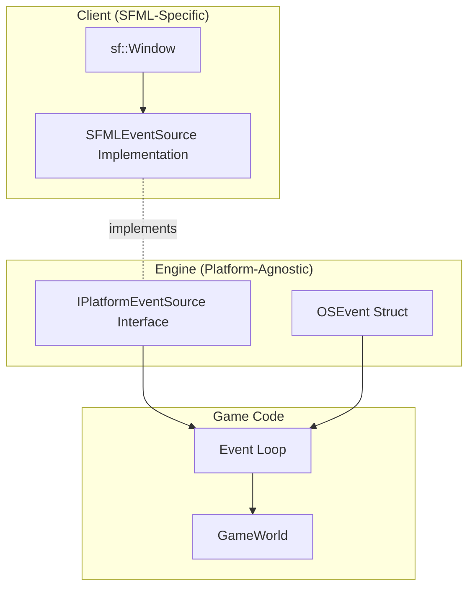

# OS Event Abstraction Layer

## Overview

The **OS Event Abstraction Layer** provides a backend-agnostic interface for handling operating system and window events (keyboard, mouse, window state). This layer isolates the engine from specific platform libraries (SFML, SDL, etc.) and enables plugin-based backends.

**Important:** This is separate from the engine's gameplay event system. OS Events represent raw platform messages (close, resize, focus, input), while gameplay events are ECS-level game logic events.

## Architecture



## Components

### 1. `Engine::Platform::OSEvent`

**Location:** `engine/include/platform/OSEvent.hpp`

Backend-agnostic structure representing operating system events:

```cpp
namespace Engine::Platform {

enum class OSEventType {
    Closed,               // Window requested to be closed
    Resized,             // Window was resized
    LostFocus,           // Window lost focus
    GainedFocus,         // Window gained focus
    TextEntered,         // Character was entered
    KeyPressed,          // Key was pressed
    KeyReleased,         // Key was released
    MouseWheelScrolled,  // Mouse wheel was scrolled
    MouseButtonPressed,  // Mouse button was pressed
    MouseButtonReleased, // Mouse button was released
    MouseMoved,          // Mouse cursor moved
    MouseEntered,        // Mouse cursor entered window
    MouseLeft,           // Mouse cursor left window
    // ...joystick events
};

struct OSEvent {
    OSEventType type;
    union {
        SizeEvent size;
        KeyEvent key;
        TextEvent text;
        MouseMoveEvent mouseMove;
        MouseButtonEvent mouseButton;
        MouseWheelScrollEvent mouseWheel;
    };
};

}  // namespace Engine::Platform
```

**Key Features:**
- Uses `Engine::Input::Key` and `Engine::Input::MouseButton` types
- Zero SFML/SDL dependencies
- Ready for future backends (SDL, GLFW, custom)

### 2. `IPlatformEventSource`

**Location:** `engine/include/platform/IPlatformEventSource.hpp`

Abstract interface for polling platform events:

```cpp
namespace Engine::Platform {

class IPlatformEventSource {
 public:
    virtual ~IPlatformEventSource() = default;

    /**
     * @brief Poll the next OS event from the platform.
     * 
     * @param out The OSEvent structure to populate with event data
     * @return true if an event was available, false otherwise
     */
    virtual bool Poll(OSEvent& out) = 0;
};

}  // namespace Engine::Platform
```

**Design Rationale:**
- Synchronous polling (no event queue or async dispatcher)
- Matches existing SFML polling behavior
- Simple interface for plugin implementations

### 3. `SFMLEventSource`

**Location:** `client/platform/SFMLEventSource.hpp/cpp`

Concrete SFML implementation of the event source:

```cpp
namespace Rtype::Client::Platform {

class SFMLEventSource : public Engine::Platform::IPlatformEventSource {
 public:
    explicit SFMLEventSource(sf::Window& window);
    
    bool Poll(Engine::Platform::OSEvent& out) override;

 private:
    sf::Window& window_;
};

}  // namespace Rtype::Client::Platform
```

**Implementation Details:**
- Wraps `sf::Window::pollEvent()` internally
- Translates `sf::Event` → `OSEvent` using existing adapter logic
- Recursively skips unsupported event types (joystick, touch)
- All SFML dependencies confined to this class

## Integration

### GameWorld Setup

The event source is initialized when creating the game world:

```cpp
// main.cpp
RC::GameWorld game_world(config.server_ip, config.tcp_port, config.udp_port);

// Initialize platform event source (SFML backend)
game_world.event_source_ = 
    std::make_unique<RC::Platform::SFMLEventSource>(game_world.window_);
```

### Event Loop

The game loop uses the interface to poll events:

```cpp
// ClientApplication.cpp
void RunGameLoop(GameWorld& game_world) {
    while (game_world.window_.isOpen()) {
        // Poll OS events via backend-agnostic interface
        Engine::Platform::OSEvent os_event;
        while (game_world.event_source_->Poll(os_event)) {
            if (os_event.type == Engine::Platform::OSEventType::Closed) {
                game_world.window_.close();
            }
            // Handle other events...
        }
        
        // Game logic, rendering, etc.
    }
}
```

**Before (Direct SFML):**
```cpp
sf::Event sfml_event;
while (game_world.window_.pollEvent(sfml_event)) {
    // Direct SFML dependency
}
```

**After (Abstracted):**
```cpp
Engine::Platform::OSEvent os_event;
while (game_world.event_source_->Poll(os_event)) {
    // Backend-agnostic
}
```

## Benefits

### 1. **Backend Independence**
The engine core has zero knowledge of SFML. Future backends (SDL, GLFW, native APIs) can be added by implementing `IPlatformEventSource`.

### 2. **Plugin Support**
Event sources can be loaded dynamically:
```cpp
// Future: Load backend from plugin
auto event_source = LoadPlugin<IPlatformEventSource>("libSDLEvents.so");
game_world.event_source_ = std::move(event_source);
```

### 3. **Testability**
Mock event sources for testing:
```cpp
class MockEventSource : public IPlatformEventSource {
    std::queue<OSEvent> events_;
public:
    void InjectEvent(OSEvent event) { events_.push(event); }
    bool Poll(OSEvent& out) override {
        if (events_.empty()) return false;
        out = events_.front();
        events_.pop();
        return true;
    }
};
```

### 4. **Separation of Concerns**
- **Engine:** Defines event types and interface
- **Client:** Implements SFML-specific adapter
- **Game:** Consumes events via interface

## Differences from Gameplay Events

| Aspect | OS Events | Gameplay Events |
|--------|-----------|-----------------|
| **Purpose** | Platform/window messages | Game logic notifications |
| **Location** | `Engine::Platform` | `Engine::Events` (ECS) |
| **Examples** | KeyPressed, Closed, Resized | EnemySpawned, PlayerDied |
| **Polling** | Synchronous via `Poll()` | Event bus / observer pattern |
| **Source** | Operating system / windowing | Game systems / entities |

## Future Extensions

### Additional Backends
```cpp
// SDL Backend
class SDLEventSource : public IPlatformEventSource {
    SDL_Window* window_;
    bool Poll(OSEvent& out) override;
};

// GLFW Backend
class GLFWEventSource : public IPlatformEventSource {
    GLFWwindow* window_;
    bool Poll(OSEvent& out) override;
};
```

### Event Filtering
```cpp
class FilteredEventSource : public IPlatformEventSource {
    std::unique_ptr<IPlatformEventSource> source_;
    std::function<bool(const OSEvent&)> filter_;
public:
    bool Poll(OSEvent& out) override {
        while (source_->Poll(out)) {
            if (filter_(out)) return true;
        }
        return false;
    }
};
```

### Event Recording/Replay
```cpp
class RecordingEventSource : public IPlatformEventSource {
    std::unique_ptr<IPlatformEventSource> source_;
    std::vector<OSEvent>& recording_;
public:
    bool Poll(OSEvent& out) override {
        if (source_->Poll(out)) {
            recording_.push_back(out);
            return true;
        }
        return false;
    }
};
```

## Related Documentation

- [Architecture Overview](../architecture.md) - Overall system design

## Implementation Notes

### Translation Logic Reuse

The SFML→OSEvent translation reuses existing adapter code:

```cpp
// SFMLEventSource.cpp
bool SFMLEventSource::Poll(Engine::Platform::OSEvent& out) {
    sf::Event sfml_event;
    if (!window_.pollEvent(sfml_event)) return false;

    switch (sfml_event.type) {
        case sf::Event::KeyPressed:
            out.type = Engine::Platform::OSEventType::KeyPressed;
            out.key.code = Adapters::FromSFMLKey(sfml_event.key.code);
            // ... other key event fields
            return true;
        // ... other cases
    }
}
```

### No Event Queue

Unlike some event systems, this abstraction does **not** introduce a queue or dispatcher. Events are polled synchronously in the main loop, matching SFML's original behavior.

### Thread Safety

The current implementation is **not thread-safe**. Event polling must occur on the same thread as the window. Future backends may need thread-safe variants.

## Testing

Unit tests covering:
- Mock event source injection
- OSEvent structure validation
- SFML translation correctness
- Interface compliance

## Conclusion

The OS Event Abstraction Layer successfully decouples the engine from SFML while maintaining identical behavior. It provides a foundation for multi-backend support and improved testability, aligning with the project's goal of creating a standalone, reusable game engine.
