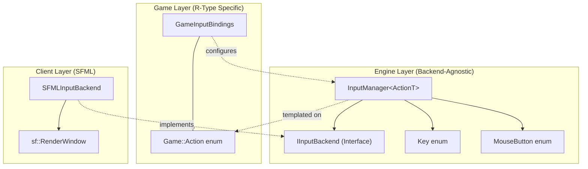

# Input Abstraction Layer

## Table of Contents

- [1. Overview](#1-overview)
- [2. Architecture](#2-architecture)
- [3. Engine Layer Components](#3-engine-layer-components)
- [4. Game Layer Components](#4-game-layer-components)
- [5. Integration Guide](#5-integration-guide)
- [6. Adding New Actions](#6-adding-new-actions)
- [7. Creating a New Backend](#7-creating-a-new-backend)

---

## 1. Overview

The **Input Abstraction Layer** provides a clean separation between:

1. **Physical Input** (raw keyboard/mouse state from SFML, SDL, etc.)
2. **Logical Actions** (game intentions like "Move Left", "Shoot", etc.)

This architecture allows:

- **Backend Independence**: Swap SFML for SDL without changing game code
- **Configurable Bindings**: Multiple keys can map to the same action
- **Clean Game Code**: Systems query actions, not physical keys
- **Engine Reusability**: The engine has no game-specific knowledge

### Design Principles

| Principle | Description |
|-----------|-------------|
| **Dependency Inversion** | Engine defines interfaces, backends implement them |
| **Separation of Concerns** | Engine handles input mechanics, game defines actions |
| **Template-Based** | InputManager is generic, works with any action enum |
| **No Global State** | All input state flows through explicit dependencies |

---

## 2. Architecture



### Layer Responsibilities

| Layer | Responsibility | Location |
|-------|---------------|----------|
| **Engine** | Generic input management, key/button enums, interfaces | `engine/include/input/` |
| **Game** | Action definitions, default bindings | `client/include/game/` |
| **Client** | Backend implementation (SFML) | `client/input/` |

---

## 3. Engine Layer Components

### 3.1 IInputBackend Interface

**Location:** `engine/include/input/IInputBackend.hpp`

The abstract interface that all input backends must implement.

```cpp
class IInputBackend {
 public:
    virtual ~IInputBackend() = default;

    // Keyboard
    virtual bool IsKeyPressed(Key key) const = 0;

    // Mouse
    virtual bool IsMouseButtonPressed(MouseButton button) const = 0;
    virtual MousePosition GetMousePosition() const = 0;
    virtual MousePosition GetMousePositionInWindow() const = 0;

    // Focus
    virtual bool HasWindowFocus() const = 0;
};
```

### 3.2 InputManager Template

**Location:** `engine/include/input/InputManager.hpp`

A generic, header-only input manager that:

- Holds an `IInputBackend` for raw input state
- Maps physical inputs to logical actions
- Provides action queries for game systems

```cpp
template <typename ActionT>
class InputManager {
 public:
    // Action queries (game code uses these)
    bool IsActionActive(ActionT action) const;
    float GetAxis(ActionT negative, ActionT positive) const;

    // Binding management
    void BindKey(ActionT action, Key key);
    void BindMouseButton(ActionT action, MouseButton button);
    void ClearBindings(ActionT action);
    void ClearAllBindings();

    // Direct access (use sparingly)
    bool IsKeyPressed(Key key) const;
    bool IsMouseButtonPressed(MouseButton button) const;
    bool HasFocus() const;
};
```

### 3.3 Key and MouseButton Enums

**Location:** `engine/include/input/Key.hpp`, `engine/include/input/MouseButton.hpp`

Backend-agnostic enums representing all supported physical inputs.

```cpp
enum class Key : uint8_t {
    Unknown = 0,
    A, B, C, D, E, F, G, H, I, J, K, L, M,
    N, O, P, Q, R, S, T, U, V, W, X, Y, Z,
    Num0, Num1, /* ... */
    Space, Enter, Escape, Tab, Backspace,
    Up, Down, Left, Right,
    LShift, RShift, LControl, RControl,
    Count
};

enum class MouseButton : uint8_t {
    Left = 0,
    Right,
    Middle,
    Extra1,
    Extra2,
    Count
};
```

---

## 4. Game Layer Components

### 4.1 Game::Action Enum

**Location:** `client/include/game/GameAction.hpp`

Defines all logical actions for R-Type. These are game-specific concepts.

```cpp
namespace Game {

enum class Action : uint8_t {
    // Movement
    MoveUp = 0,
    MoveDown,
    MoveLeft,
    MoveRight,

    // Combat
    Shoot,
    ChargeShoot,

    // UI
    Confirm,
    Cancel,
    Pause,

    // Menu navigation
    MenuUp,
    MenuDown,
    MenuLeft,
    MenuRight,

    Count  // Keep last
};

}  // namespace Game
```

### 4.2 GameInputBindings

**Location:** `client/include/game/GameInputBindings.hpp`

Sets up the default key bindings for R-Type.

```cpp
namespace Game {

template <typename ActionT>
void SetupDefaultBindings(Engine::Input::InputManager<ActionT> &input_manager) {
    // Movement - QZSD (French) + WASD + Arrows
    input_manager.BindKey(Action::MoveUp, Key::Z);
    input_manager.BindKey(Action::MoveUp, Key::W);
    input_manager.BindKey(Action::MoveUp, Key::Up);

    input_manager.BindKey(Action::MoveDown, Key::S);
    input_manager.BindKey(Action::MoveDown, Key::Down);

    // ... etc.

    // Combat
    input_manager.BindKey(Action::Shoot, Key::Space);
    input_manager.BindMouseButton(Action::Shoot, MouseButton::Left);
}

}  // namespace Game
```

---

## 5. Integration Guide

### 5.1 Setting Up the Input System

In your game initialization:

```cpp
#include "input/SFMLInputBackend.hpp"
#include "game/GameAction.hpp"
#include "game/GameInputBindings.hpp"

// Create the SFML backend
auto backend = std::make_unique<SFMLInputBackend>(window);

// Create the input manager with the game's action type
auto input_manager = 
    std::make_unique<Engine::Input::InputManager<Game::Action>>(
        std::move(backend));

// Set up default bindings
Game::SetupDefaultBindings(*input_manager);
```

### 5.2 Using in Systems

Systems should query actions, not physical keys:

```cpp
void InputSystem(Engine::registry &reg,
    Engine::Input::InputManager<Game::Action> &input_manager,
    Engine::sparse_array<Component::Inputs> &inputs) {
    
    if (!input_manager.HasFocus())
        return;

    for (auto &&[i, input] : make_indexed_zipper(inputs)) {
        // Use GetAxis for smooth movement
        input.horizontal = input_manager.GetAxis(
            Game::Action::MoveLeft, 
            Game::Action::MoveRight);
        
        input.vertical = input_manager.GetAxis(
            Game::Action::MoveUp, 
            Game::Action::MoveDown);

        // Use IsActionActive for discrete actions
        input.shoot = input_manager.IsActionActive(Game::Action::Shoot);
    }
}
```

---

## 6. Adding New Actions

To add a new action (e.g., "Dash"):

### Step 1: Add to Game::Action enum

```cpp
// In client/include/game/GameAction.hpp
enum class Action : uint8_t {
    // ... existing actions ...
    Dash,  // Add new action

    Count  // Keep last
};
```

### Step 2: Add name mapping (optional)

```cpp
inline const char *GetActionName(Action action) {
    switch (action) {
        // ... existing cases ...
        case Action::Dash: return "Dash";
        default: return "Unknown";
    }
}
```

### Step 3: Bind keys

```cpp
// In GameInputBindings.hpp or at runtime
input_manager.BindKey(Action::Dash, Key::LShift);
input_manager.BindKey(Action::Dash, Key::E);
```

### Step 4: Use in systems

```cpp
if (input_manager.IsActionActive(Game::Action::Dash)) {
    // Perform dash
}
```

---

## 7. Creating a New Backend

To support a different library (e.g., SDL):

### Step 1: Implement IInputBackend

```cpp
// In client/input/SDLInputBackend.hpp
class SDLInputBackend : public Engine::Input::IInputBackend {
 public:
    explicit SDLInputBackend(SDL_Window *window);

    bool IsKeyPressed(Engine::Input::Key key) const override;
    bool IsMouseButtonPressed(Engine::Input::MouseButton button) const override;
    Engine::Input::MousePosition GetMousePosition() const override;
    Engine::Input::MousePosition GetMousePositionInWindow() const override;
    bool HasWindowFocus() const override;

 private:
    SDL_Window *window_;
    
    // Helper to convert Engine::Input::Key to SDL_Scancode
    static SDL_Scancode ToSDLKey(Engine::Input::Key key);
};
```

### Step 2: Implement key mapping

```cpp
// In SDLInputBackend.cpp
SDL_Scancode SDLInputBackend::ToSDLKey(Engine::Input::Key key) {
    switch (key) {
        case Key::A: return SDL_SCANCODE_A;
        case Key::B: return SDL_SCANCODE_B;
        // ... etc.
        default: return SDL_SCANCODE_UNKNOWN;
    }
}

bool SDLInputBackend::IsKeyPressed(Engine::Input::Key key) const {
    const Uint8 *state = SDL_GetKeyboardState(nullptr);
    return state[ToSDLKey(key)];
}
```

### Step 3: Use the new backend

```cpp
auto backend = std::make_unique<SDLInputBackend>(sdl_window);
auto input_manager = 
    std::make_unique<Engine::Input::InputManager<Game::Action>>(
        std::move(backend));
```

No changes to game code required!

---

## See Also

- [Input System](systems/input-system.md) - The system that uses InputManager
- [Architecture](architecture.md) - Overall project architecture
- [Technology Choices](technology-choices.md) - Why we chose this design
